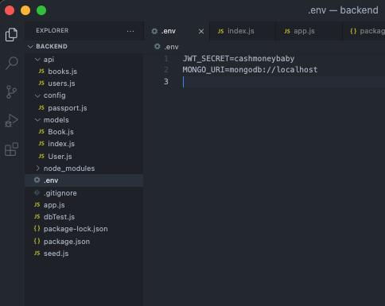

# mern-auth-pantry-temp-front-back
MERN Authentication for project 3 Pantry App. Both front and back end.

## You need to npm install both the backend and frontend 
## Make sure you open seperate vs codes for backend and frontend before npm install

## Add a .gitignore and .env to the backend add JWT_SECRET and MONGO_URI
### This is what mine looks like:
